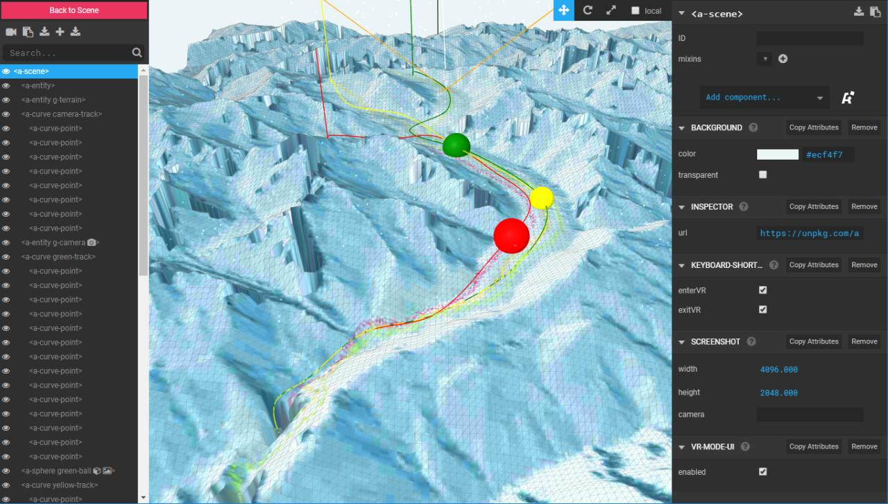

Aletsch-Rutsch
==============

This is a visualisation of the [Aletsch Glacier](https://en.wikipedia.org/wiki/Aletsch_Glacier) in Switzerland. On the topic of [Retreat of glaciers](https://en.wikipedia.org/wiki/Retreat_of_glaciers_since_1850), Wikipedia currently says:

> Aletsch Glacier retreated 2.8 km (1.7 mi) from 1880 to 2009. This rate of retreat has also increased since 1980, with 30%, or 800 m (2,600 ft), of the total retreat occurring in the last 20% of the time period.

The colored "snowballs" seen in this dataviz are increasing in weight according to real data: three climate indicators for the time period 2011-2017:

- **RED**: Area-mean temperatures of northern Switzerland > 1000 m
- **GREEN**: Cumulative precipitation (mm or litres/m2) 
- **YELLOW**: Global irradiation (Watts/m2)

With this we attempt to point some attention at the lack of easily accessible, open data available to assess such claims. See the [data README](data/README.md) for details.

#### Inspiration

This project was further inspired by [Glacier changing in time](https://www.schoolmaps.ch/2015/11/13/gletscher-im-wandel-der-zeit/), a learning module by David Oesch based on a storymap from [Swisstopo](https://www.geo.admin.ch/en/thematic-geoportals-federal-offices/storymaps-telling-stories-with-geodata.html), as well as these two images available from Wikimedia Commons:

#### Technical info

The terrain seen here is a representation of the actual alpine region, rendered as a 3D model using the Virtual Reality library [A-Frame](https://github.com/aframevr/aframe/) and several A-Frame components: 

- [alongpath](https://github.com/protyze/aframe-alongpath-component)
- [curve](https://github.com/protyze/aframe-curve-component)
- [particle system](https://github.com/IdeaSpaceVR/aframe-particle-system-component)
- [terrain model](https://github.com/bryik/aframe-terrain-model-component)

Additionally, [Zepto.js](http://zeptojs.com/) is used for loader code.

A description of how the terrain model was prepared can be found in the [geodata README](geodata/README.md).

Note that it was initially attempted to use a physics engine to simulate the rolling of the spheres down the glacier. However, the complexity of the model as well as lack of time was a constraint. Therefore the balls are rolling along fixed tracks, which were hand-palced using the A-Frame inspector:

Apologies for the rather unconvincing movements.. perhaps we should make a racing game out of it instead ;-)

#### What's with the Gobbledigook?

You mean, the words shown at the top during loading? Well, after some playful experiments with A.I. poetry generators over the holidays, a few choice samples were collected in `haiku.js` and shown randomly. See [PoetRNN.jl](https://github.com/loleg/PoetRNN.jl) (GitHub)

Oh, and happy new year! :tada:

# License

This repository is published under the [MIT License](LICENSE).

The contents of the `data` folder are published under the Public Domain Dedication and License v1.0 whose full text can be found at: http://www.opendatacommons.org/licenses/pddl/1.0/.