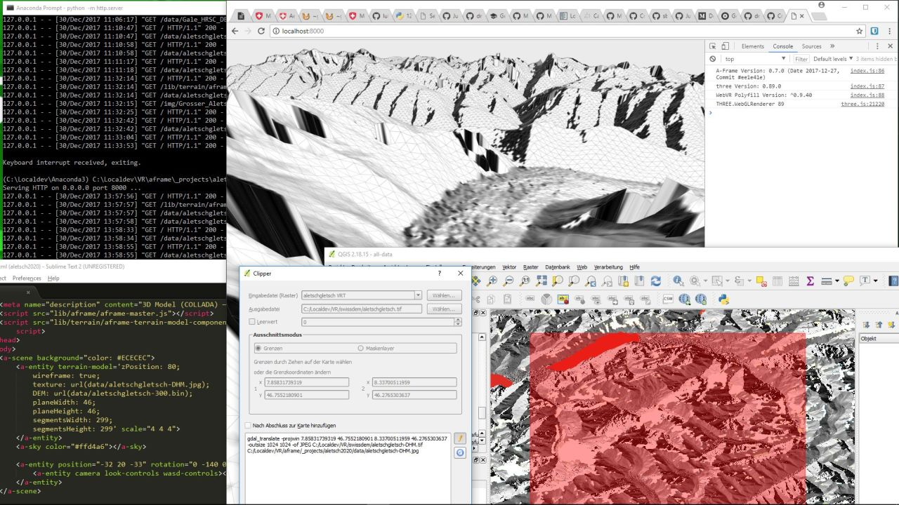

Digital model of Aletsch Glacier
================================

This dataset is an extract of the open [Digital Elevation Model for Switzerland](https://github.com/lukasmartinelli/swissdem) compiled by [Lukas Martinelli](https://github.com/lukasmartinelli). It was cropped, resampled and converted for use in applications such as 3D visualisation, covering the area of the [Aletsch Glacier](https://en.wikipedia.org/wiki/Aletsch_Glacier) and surrounding mountains.

Using the open source [QGIS software](https://www.qgis.org), a composite layer called "virtual raster" (Raster-> Miscellaneous-> Build Virtual Raster/Catalog) was created from two of the GeoTIFFs in the DEM dataset.

Then a bounding box was selected with the [Clipper tool](https://docs.qgis.org/2.18/en/docs/user_manual/plugins/plugins_gdaltools.html?highlight=clipper#extraction), and applied on the virtual raster. The resulting GDAL command was slightly modified to use the [ENVI format](http://www.gdal.org/frmt_various.html#ENVI) at 16bit depth with 300x300 resolution into the output file (`aletschgletsch-300.bin`) as follows:

```
gdal_translate -projwin 7.85831739319 46.7552180901 8.33700511959 46.2765303637 -ot UInt16 -outsize 300 300 -of ENVI aletschgletsch.vrt aletschgletsch-300.bin
```

This can be seen in the following screenshot, along with an intermediary preview of the heightmap:



Additionally, the QGIS/GDAL [DEM (Terrain models)](https://docs.qgis.org/2.18/en/docs/user_manual/plugins/plugins_gdaltools.html?highlight=DEM#analysis) tool was used to create a hill shade rendering (`aletschgletsch-DHM.jpg`), which served as the basis for the texture map (`aletschgletsch-DHM-g.jpg`) which was edited using the [GIMP program](https://www.gimp.org/).

# License

As the source data, this extract is published here under the Public Domain Dedication and License v1.0 whose full text can be found at: http://www.opendatacommons.org/licenses/pddl/1.0/.